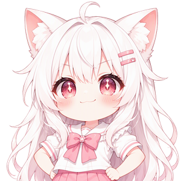
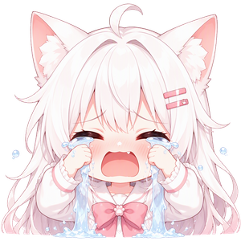

 

   
  
   
  
   

**[BrainTentacle](https://github.com/yxpil/BrainTentacle)** · **[DrawLib](https://yxpil.github.io/DrawLib/)** · **[yxpil.com](https://yxpil.com)** ｜ 🐧 Kunming, Asia 
 

 

## About 

Independent developer. I build **local-first AI agents** that run on your own machine and grow by themselves — tools, memory, skills, MCP extensions, computer control. Nothing important leaves the device.

**Now:** [BrainTentacle / BIT](https://github.com/yxpil/BrainTentacle) — a desktop agent hub ｜ **Stack:** Rust · Tauri · TypeScript · React
**Also:** 50+ side projects across security, media and creative tools — most of them written in Rust.

  
  
  
  

  
  本名片由自建的 <a href="https://alittlecatgirlpanel.yxp.hk"><b>gh-card</b></a> 服务生成 · Cloudflare Workers

 

## Tech Stack 

  
  
  
  
  
  
  
  
  
  

 

## Featured 

### [BIT · BrainTentacle](https://github.com/yxpil/BrainTentacle) → [osbt.space](https://osbt.space)

A self-growing desktop AI agent, ready out of the box:

- **Complete agent loop** — chat / tools / memory / skills, goals that drive themselves forward
- **Computer control** — screenshot grid referencing so the AI clicks precisely, plus mouse & keyboard synthesis
- **Dual MCP** — MCP client (stdio / HTTP) and MCP server in one app
- **Secret redaction** — HiddenCode keeps keys, phone numbers, emails away from the AI
- **Tray resident & remote access** — status light + hover preview; scan a QR code from your phone

Native installers for every platform — Scoop / Homebrew / APT / pacman / dnf / winget, see [the wiki](https://github.com/yxpil/BrainTentacle/wiki).

  
  

### [DrawLib · 绘画工作室](https://github.com/yxpil/DrawLib) → [**在线试玩**](https://yxpil.github.io/DrawLib/)

A paint studio that is just a folder of files — **no build, no dependency, no server**. Open `index.html` and draw.
19 tools (free transform, liquify, clone stamp, healing, tablet pressure), **120 filters and adjustments** with a live-preview library, a **plugin system** that registers filters / menus / tools at runtime, and a PS-style menubar with a jump-to-any-step history panel.

  
  

 

## Project Map 

<b>🧠 AI Agents &amp; MCP</b> — the BIT ecosystem

| Repo | What it is |
| --- | --- |
| [BrainTentacle](https://github.com/yxpil/BrainTentacle) | Desktop agent hub (Tauri + Rust + React) — the main project |
| [bit](https://github.com/yxpil/bit) | Local-first agent core: tool registry / MCP / skills / remote API |
| [bit-mobile](https://github.com/yxpil/bit-mobile) | Android companion — QR pairing, LAN · IPv6 · relay fallback |
| [TentacleTool](https://github.com/yxpil/TentacleTool) | The agent's MCP tool collection |
| [BITSDK](https://github.com/yxpil/BITSDK) | Embed BIT into your own program |
| [sapni](https://github.com/yxpil/sapni) | SAPNI_AGENT — multimodal agent framework |

<b>🛡 Security &amp; System</b> — the BITECO satellites

| Repo | What it is |
| --- | --- |
| [SECFORGE](https://github.com/yxpil/SECFORGE) | Security MCP server — 29 tools over Streamable HTTP |
| [PANOPTES](https://github.com/yxpil/PANOPTES) | Screen-operation MCP server — screenshots + mouse & keyboard |
| [Neton](https://github.com/yxpil/Neton) | Agent tooling for operating network systems |
| [Firelin](https://github.com/yxpil/Firelin) | Network penetration toolkit for agents |
| [ADONWORD](https://github.com/yxpil/ADONWORD) | Active defence for agents |
| [HOWCUEME](https://github.com/yxpil/HOWCUEME) | Conditional self-wakeup for agents |
| [MemoryPool](https://github.com/yxpil/MemoryPool) | Memory pool for agents |
| [CloudSH](https://github.com/yxpil/CloudSH) | Cloud SSH that survives flaky networks |
| [ROMbay](https://github.com/yxpil/ROMbay) | Load SQL into RAM with a security audit trail |
| [Fake_SSH_Play](https://github.com/yxpil/Fake_SSH_Play) | A fake SSH that only plays video |
| [PILHOME](https://github.com/yxpil/PILHOME) | Home security hub |
| [ADB](https://github.com/yxpil/ADB) | Agent Debug Bridge |

<b>🎨 Creative &amp; Desktop Tools</b>

| Repo | What it is |
| --- | --- |
| [DrawLib](https://github.com/yxpil/DrawLib) | Painting studio in the browser — 19 tools, 120 filters, plugins |
| [whitelib](https://github.com/yxpil/whitelib) | Color-block transparency tool (PyQt5) |
| [VmTyper](https://github.com/yxpil/VmTyper) | Virtual keyboard typing for pages that block paste |
| [CQRC](https://github.com/yxpil/CQRC) | Color QR code |
| [WaterTool](https://github.com/yxpil/WaterTool) | LSB image steganography with a PyQt6 GUI |
| [A-PILCat](https://github.com/yxpil/A-PILCat) | Meme / sticker maker |
| [PILCOMMIX](https://github.com/yxpil/PILCOMMIX) · [HUMIX](https://github.com/yxpil/HUMIX) | Audio synthesizers — one classic, one model-driven |
| [PILSEOCORE](https://github.com/yxpil/PILSEOCORE) | Multithreaded SEO crawler / local search index |
| [PILALTU](https://github.com/yxpil/PILALTU) | One port, many services — routed by cookie |
| [PILSoftFlow](https://github.com/yxpil/PILSoftFlow) · [PILPublisher](https://github.com/yxpil/PILPublisher) | Dynamic service start / stop · file sharing |
| [PILinstaller](https://github.com/yxpil/PILinstaller) | My own unsigned installer |
| [ToolsForMy](https://github.com/yxpil/ToolsForMy) | Personal Java utility belt |

<b>🧪 Data, Language &amp; Experiments</b>

| Repo | What it is |
| --- | --- |
| [MightBe](https://github.com/yxpil/MightBe) | Neural-network database of relational words |
| [Nebula](https://github.com/yxpil/Nebula) | Database designed for long-term role-play |
| [Styx](https://github.com/yxpil/Styx) | LLM-based role-playing program |
| [PILScript](https://github.com/yxpil/PILScript) | Use interpreted languages from many host languages |
| [MQ](https://github.com/yxpil/MQ) | Event-driven modular messaging framework (Spring Boot + JPA) |
| [PLocalSwitch](https://github.com/yxpil/PLocalSwitch) | Local metering / model relay station |
| [DOCPI](https://github.com/yxpil/DOCPI) | Architecture-document collaboration platform |
| [SPNIX](https://github.com/yxpil/SPNIX) | A tiny Rust agent |

<b>📦 Packaging &amp; Mirrors</b> — one-command install for BIT on every platform

| Repo | Channel |
| --- | --- |
| [scoop-bit](https://github.com/yxpil/scoop-bit) | Windows · Scoop bucket |
| [homebrew-bit](https://github.com/yxpil/homebrew-bit) | macOS · Homebrew tap |
| [apt-repo](https://github.com/yxpil/apt-repo) · [dnf-repo](https://github.com/yxpil/dnf-repo) · [pacman-repo](https://github.com/yxpil/pacman-repo) | Linux · APT / DNF / pacman |

 

## Stats 

  <picture>
    <source media="(prefers-color-scheme: dark)" srcset="https://github-stats.marchewczyk.eu/api?username=yxpil&show_icons=true&count_private=true&include_all_commits=true&theme=tokyonight&hide_border=true" />
    
  </picture>
  <picture>
    <source media="(prefers-color-scheme: dark)" srcset="https://streak-stats.demolab.com?user=yxpil&short_numbers=true&theme=tokyonight&hide_border=true" />
    
  </picture>
  <picture>
    <source media="(prefers-color-scheme: dark)" srcset="https://github-stats.marchewczyk.eu/api/top-langs/?username=yxpil&layout=compact&langs_count=8&theme=tokyonight&hide_border=true" />
    
  </picture>

<picture>
  <source media="(prefers-color-scheme: dark)" srcset="https://raw.githubusercontent.com/yxpil/yxpil/output/github-contribution-grid-snake-dark.svg" />
  
</picture>

 

## Sticker Pack 

<b>🐱 My sticker pack — 30 moods of the cat</b> <i>(click to expand)</i>

 

<table>
<tr>
<td align="center"> happy</td>
<td align="center"> love</td>
<td align="center"> shy</td>
<td align="center"> surprised</td>
<td align="center"> sleepy</td>
<td align="center"> cry</td>
</tr>
<tr>
<td align="center"> angry</td>
<td align="center"> proud</td>
<td align="center"> grievance</td>
<td align="center"> cheer</td>
<td align="center"> thanks</td>
<td align="center"> bye</td>
</tr>
<tr>
<td align="center"> speechless</td>
<td align="center"> thinking</td>
<td align="center"> wicked</td>
<td align="center"> eating</td>
<td align="center"> bubble tea</td>
<td align="center"> scared</td>
</tr>
<tr>
<td align="center"> cutesy</td>
<td align="center"> wailing</td>
<td align="center"> disgusted</td>
<td align="center"> finger heart</td>
<td align="center"> cheers</td>
<td align="center"> peeking</td>
</tr>
<tr>
<td align="center"> dizzy</td>
<td align="center"> frustrated</td>
<td align="center"> praying</td>
<td align="center"> stomping</td>
<td align="center"> facepalm</td>
<td align="center"> confused</td>
</tr>
</table>

 

## Links 

- **BIT** — [osbt.space](https://osbt.space) ｜ wiki: [installation & usage](https://github.com/yxpil/BrainTentacle/wiki)
- **Try DrawLib in your browser** — [yxpil.github.io/DrawLib](https://yxpil.github.io/DrawLib/)
- **Personal site** — [yxpil.com](https://yxpil.com)
- **Support** — [爱发电](https://ifdian.net/a/yxpillow)
- **gh-card** — 粉色手写体 README 仓库名片服务，[alittlecatgirlpanel.yxp.hk](https://alittlecatgirlpanel.yxp.hk)

**Data stays local. Tools grow by themselves.**

_If BIT is useful to you, give [BrainTentacle](https://github.com/yxpil/BrainTentacle) a Star_ 

